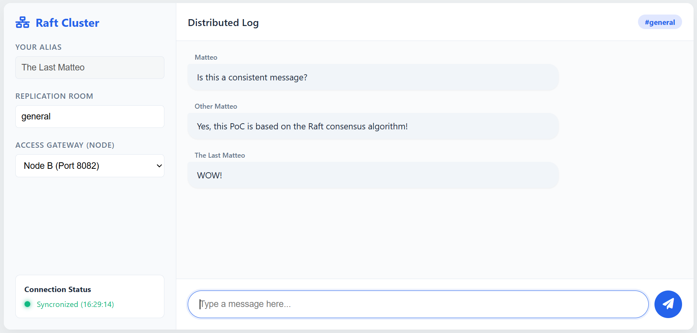

  

# RaftMessaging - A Raft-Based Application for Group Communication (Not Encrypted)
## Abstract
A Java 21+ Proof-of-Concept for a message streaming distributed that ensurens data consistency through the Raft consensus algorithm.

## Documentation
This project implements the **Raft Consensus Algorithm**, designed to manage a consistent and fault-tolerant distributed state. The system facilitates a multi-room chat application where messages are atomically replicated across a cluster of independent nodes.

A [Technical Report](./TechnicalReport.pdf) is available in this repo.

There is also a [Written Integration](./WrittenIntegration.pdf) which aims to illustrate a bit deeper some choices about the project.

### System Architecture

The core logic resides in the `com.raft.node` package. Each node operates as a finite state machine that can transition between three roles: **Follower**, **Candidate**, and **Leader**.

#### Key Components

* **Node.java**: Manages business logic, state transitions, and integration with networking and storage subsystems.
* **Replicated Log**: A strictly ordered sequence of `LogEntry` objects containing commands to be applied to the state machine.
* **WalStorage.java**: Implements persistence using *Write-Ahead Logging* to ensure data durability across crashes.
* **Network Abstraction**: Support for both `InMemoryNetwork.java` (for localized testing) and `HttpNetwork.java` (for real-world HTTP-based deployments).

### Protocol Features

The implementation adheres to the original Raft specification while incorporating optimizations for high-performance scenarios:

1.  **Leader Election**: Utilizes randomized timeouts to minimize election collisions and ensure cluster stability.
2.  **Pre-Vote Phase**: A safety optimization that prevents unnecessary term inflation by checking candidacy eligibility before incrementing the local term.
3.  **Log Compaction (Snapshotting)**: An asynchronous mechanism that prunes the replicated log and saves the current state machine, preventing infinite memory growth.
4.  **Idempotency**: Client session tracking ensures *exactly-once* semantics for commands, even during network retries or leader changes.
5.  **Natural Batching**: Optimizes network throughput by aggregating multiple log entries into a single `AppendEntries` RPC.

### Getting Started

#### Prerequisites
* Java 21+ (utilizing Virtual Threads/Project Loom).
* Maven 3.8+.
* Docker & Docker Compose (optional for containerization).

### Web Interface
An interactive monitoring dashboard (`index.html`) is provided to:
* Monitor real-time log synchronization across the cluster.
* Send messages to specific rooms via node-specific HTTP gateways.
* Observe system resilience by dynamically switching the gateway node.

In order to access to the web interface, you need to start the docker service with:

`docker-compose up --build`

To clear the old volumes and images, please use:

`docker-compose down -v`

`docker builder prune -f`

### Performance Analysis
By leveraging **Virtual Threads**, the system manages high concurrency with minimal CPU overhead. The batching mechanism allows for performance peaks exceeding 15,000 requests per second during in-memory stress testing.